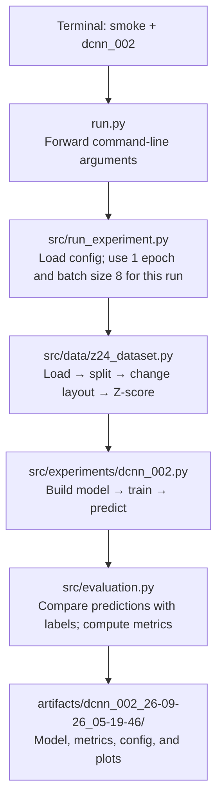

# Z24 classification

The same codebase runs locally and on Kaggle. Use your local machine to inspect data, debug, and run quick checks; use Kaggle's GPU for full training. The dataset is stored separately and is not committed to GitHub.

## Choose an experiment

| ID | Pipeline |
| --- | --- |
| `dcnn_001` | DCNN-LSTM-ResNet based on the teacher's reference configuration |
| `dcnn_002` | DCNN-LSTM-ResNet optimized for training speed |
| `tsai_001` | tsai ResNet |

The entry point is `run.py`:

```powershell
python run.py <check|smoke|train> --experiment <ID>
```

If you omit `--experiment`, the default is `dcnn_002`.

| Action | What it does | Output |
| --- | --- | --- |
| `check` | Loads and validates the dataset and setup-based split | Prints shapes and train/validation/test sizes; does not train |
| `smoke` | Runs the full pipeline on real data for one epoch with batch size at most 8 | Saves results under `artifacts/`; does not create a ZIP |
| `train` | Trains with the epochs and batch size from the selected config | Saves results and a ZIP under `artifacts/` |

`smoke` changes the parameters only for that run; it does not edit the JSON config. One-epoch results verify that the pipeline works, but are not final benchmark results.

## Run locally

Open PowerShell in the project root and activate your Python environment:

```powershell
cd C:\Users\phuotran\Data\research\shm
.\.venv\Scripts\Activate.ps1
python -m pip install -r requirements.txt
```

Locally, the loader reads `raw_data/dataset.zip`, extracts the two NPY files into `processed/z24_dataset/`, and reuses that cache on later runs. Run all commands below from the project root.

Check the dataset and split without initializing a model:

```powershell
python run.py check --experiment dcnn_001
python run.py check --experiment dcnn_002
python run.py check --experiment tsai_001
```

Smoke-test the full pipeline for one epoch:

```powershell
python run.py smoke --experiment dcnn_001
python run.py smoke --experiment dcnn_002
python run.py smoke --experiment tsai_001
```

Train using each experiment's config:

```powershell
python run.py train --experiment dcnn_001
python run.py train --experiment dcnn_002
python run.py train --experiment tsai_001
```

Each command runs **one** experiment. Native Windows TensorFlow may use the CPU, so even a one-epoch smoke test can take time. To step through `dcnn_002`, select `Z24: Debug dcnn_002 (1 epoch)` in VS Code, then use Run and Debug → F5.

## Train on Kaggle

1. Commit and push the code version you want to train to GitHub. Keep the dataset on Kaggle.
2. Attach the Kaggle Dataset named `dataset`, containing `inputs.npy` and `labels.npy`.
3. Enable a GPU and Internet access, then open `notebooks/kaggle_runner.ipynb`.
4. Set `EXPERIMENT_ID` in the first code cell to `dcnn_001`, `dcnn_002`, or `tsai_001`.
5. Select **Run All**. The notebook clones the repository, runs `python run.py train --experiment <ID>`, then displays split metrics, the training benchmark, learning curves, and the test confusion matrix.

The runner clones the repository once per Kaggle session and reuses that local clone on repeated runs. Restart the Kaggle session when you need it to clone a newly pushed commit.

On Kaggle, the loader finds the attached `inputs.npy` and `labels.npy` together under `/kaggle/input`, including nested paths such as `/kaggle/input/datasets/<owner>/dataset/`. If multiple matching pairs are attached, it stops rather than silently selecting the wrong dataset. Results and the downloadable ZIP are written to `/kaggle/working/results/`. Internet access is needed to clone the repository and, for `tsai_001`, install missing packages from PyPI. The notebook uses `--no-deps` for these targeted installs to preserve Kaggle's CUDA-enabled PyTorch. Run each experiment in a fresh Kaggle session so frameworks do not retain each other's GPU memory.

## Execution flow and input/output by file

Example command: `python run.py smoke --experiment dcnn_002`.



| File | Example input | Example output |
| --- | --- | --- |
| `run.py` | `smoke --experiment dcnn_002` | Passes the `smoke` action and `dcnn_002` ID to `src/run_experiment.py` |
| `src/run_experiment.py` | `configs/dcnn_002.json`: 100 epochs, batch size 32 | Temporary smoke settings: 1 epoch, batch size 8; the JSON file stays unchanged |
| `src/data/z24_dataset.py` | `inputs.npy` `(1530, 27, 6000)` and `labels.npy` `(1530,)` | Train `(1020, 6000, 27)`, validation `(170, 6000, 27)`, test `(340, 6000, 27)`; Z-score using training-set statistics |
| `src/experiments/dcnn_002.py` | Prepared train/validation/test arrays; training batches have shape `(8, 6000, 27)` | Trained model, training history, and predictions for all three splits |
| `src/evaluation.py` | True labels and predictions, such as `true=[2,4,1]`, `pred=[2,3,1]` | Accuracy, macro precision/recall/F1, and a confusion matrix for each split |
| `artifacts/dcnn_002_DD-MM-YY_HH-MM-SS/` | Model, config, split, and metrics | Model file, `split_metrics.csv`, `history.csv`, `experiment.json`, and plots; a smoke run creates no ZIP |

Small example of the layout change for `dcnn_002` (the real data has 27 sensors and 6,000 time samples):

```text
In the NPY file: sensors × time     Model input: time × sensors
[[ 1,  2,  3],                →     [[ 1, 10],
 [10, 20, 30]]                      [ 2, 20],
                                    [ 3, 30]]
```

`src/experiments/dcnn_002.py` passes signals through the model to produce predictions. `src/evaluation.py` receives **predictions and true labels**, not raw signals. Validation is monitored during training; the test set is used only for evaluation and never updates model weights.

## Dataset and split

```text
inputs.npy  (1530, 27, 6000), float32
labels.npy  (1530,), int64
```

All three experiments use seed 42 and split by setup, keeping segments from the same recording in the same split:

```text
train       1020 samples, setups [3, 0, 7, 2, 4, 6]
validation   170 samples, setup  [1]
test         340 samples, setups [5, 8]
```

Each sensor is Z-score normalized using the training split's mean and standard deviation. `dcnn_002` receives `(samples, 6000, 27)`; `dcnn_001` and `tsai_001` receive `(samples, 27, 6000)`.

## File map

```text
run.py                          Entry point; accepts check/smoke/train and --experiment
configs/*.json                  Parameters for each experiment
src/run_experiment.py           Selects the config, dataset, experiment, and output location
src/data/z24_dataset.py         Loads data, splits by setup, and normalizes
src/experiments/dcnn_001.py     Model and training procedure for dcnn_001
src/experiments/dcnn_002.py     Model and training procedure for dcnn_002
src/experiments/tsai_001.py     Model and training procedure for tsai_001
src/evaluation.py               Accuracy and macro precision/recall/F1
notebooks/kaggle_runner.ipynb   Starts training on Kaggle
```

Each run saves `config.json`, `dataset.json`, `experiment.json`, `history.csv`, `split_metrics.csv`, benchmark results, confusion matrices, Z-score statistics, and the trained model. Local results go to `artifacts/`; Kaggle results go to `/kaggle/working/results/`.
